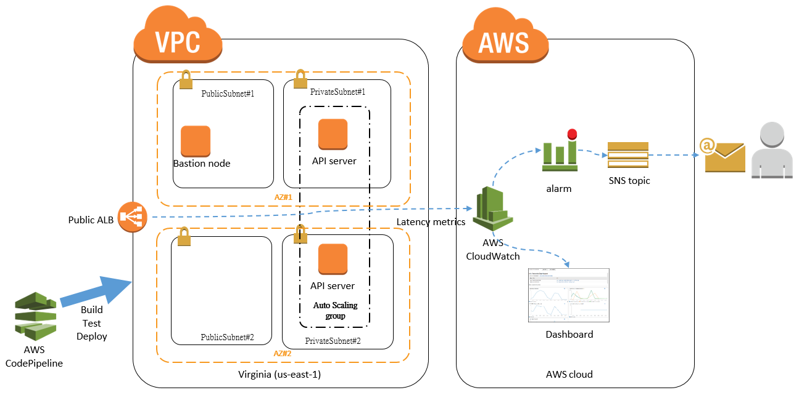
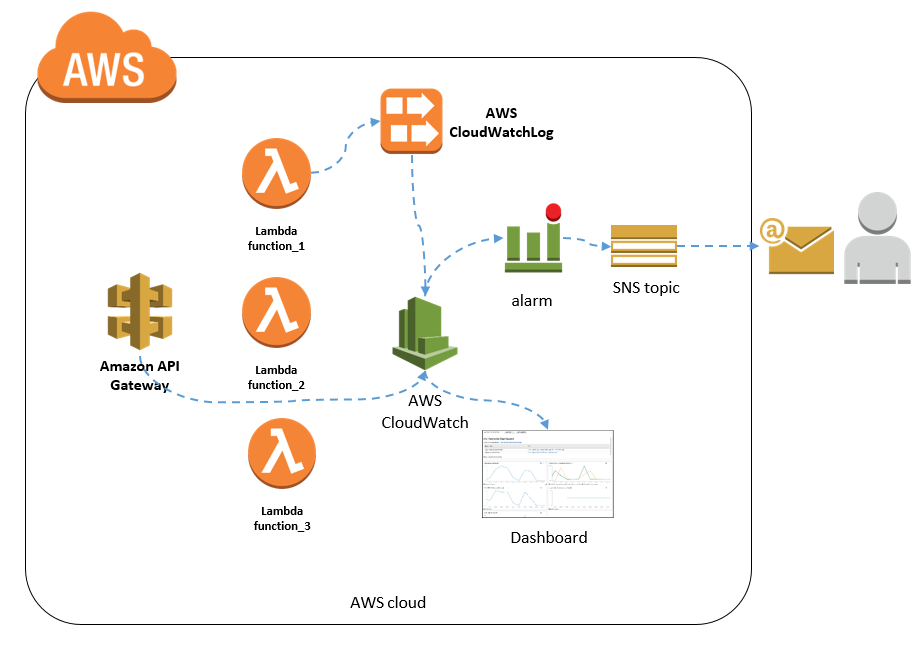
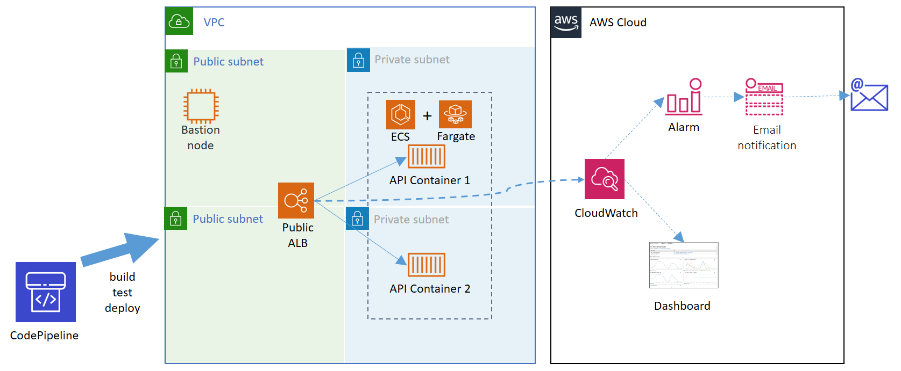

# aws-cicd
Materials for AWS CICD workshop

# Content
* [Slides](#slides)
* [Prerequisites](#prerequisites)
* [Hands-on](#hands-on)
  * [CI/CD with EC2 on AWS](#cicd-with-ec2-on-aws)
    * [0. Overview](#0-overview)
    * [1. Launch AWS CodePipeline](#1-launch-aws-codepipeline)
    * [2. AWS CodePipline should automatically trigger a build at first place](#2-aws-codepipline-should-automatically-trigger-a-build-at-first-place)
    * [3. Take a look at every component in the overall CodePipeline](#3-take-a-look-at-every-component-in-the-overall-codepipeline)
    * [4. Take a look at our RESTful API service](#4-take-a-look-at-our-restful-api-service)
  * [CI/CD with API gateway + Lambda functions on AWS](#cicd-with-api-gateway--lambda-functions-on-aws)
    * [0. Overview](#0-overview-1)
    * [1. Launch AWS CodePipeline](#1-launch-aws-codepipeline-1)
    * [2. AWS CodePipline should automatically trigger a build at first place](#2-aws-codepipline-should-automatically-trigger-a-build-at-first-place-1)
    * [3. Take a look at every component in the overall CodePipeline](#3-take-a-look-at-every-component-in-the-overall-codepipeline-1)
    * [4. Take a look at our RESTful API service](#4-take-a-look-at-our-restful-api-service-1)
  * [CI/CD with ECS + Fargate on AWS](#cicd-with-ecs--fargate-on-aws)
    * [0. Overview](#0-overview-2)
    * [1. Launch AWS CodePipeline](#1-launch-aws-codepipeline-2)
    * [2. AWS CodePipline should automatically trigger a build at first place](#2-aws-codepipline-should-automatically-trigger-a-build-at-first-place-2)
    * [3. Take a look at every component in the overall CodePipeline](#3-take-a-look-at-every-component-in-the-overall-codepipeline-2)
    * [4. Take a look at our RESTful API service](#4-take-a-look-at-our-restful-api-service-2)
  * [Delete hands-on resources](#delete-hands-on-resources)
* [Tips](#tips)
  * [Sync your forked git repo](#sync-your-forked-git-repo)

# Slides

Here are the slides I used in the workshop

  * The CICD journey of SPN Infra., Coretech, Trendmico on AWS
    * [slides](https://www.slideshare.net/takeshi_miao/20171122-aws-usergrpcoretechspncicdawsv01/1)
  * CI/CD for Serverless and Containerized Applications (DEV309-R1) - AWS re:Invent 2018
    * [slides](https://www.slideshare.net/AmazonWebServices/cicd-for-serverless-and-containerized-applications-dev309r1-aws-reinvent-2018)
    * [Video](https://www.youtube.com/watch?v=01ewawuL-IY)
# References
  * https://github.com/awslabs/aws-cloudformation-templates
    * A good Cloudformation examples git repo maintained by AWS
    * I rely on AWS CLoudformation heavily in the following handsons for building CD 

# Prerequisites
[Back to top](#content)

1. An AWS ([Amazon Web Service](https://aws.amazon.com/)) account W/ **administrator permission**, if you have none, to get one !

There are few things need your notices and actions in your AWS account
  * All the hands-on activities will be in region **us-east-1**, codes are not tested in other regions.
  * And you need to make sure you can create bucket and put files on [S3](https://s3.console.aws.amazon.com/s3/home?region=us-east-1)... due to you can not use it before account activated successfully.
  * [Create a SSH key](http://docs.aws.amazon.com/AWSEC2/latest/UserGuide/ec2-key-pairs.html#having-ec2-create-your-key-pair) (e.g. cicd) in us-east-1 region under your AWS account.
  
2. The AWS expenses will occur in the hands-ons, it should cost less than USD $1.0 for each hands-on...
3. A public [GitHub](https://github.com/) account, if you have none, to get one !

There are two more things need your actions in your GitHub account
  * Fork this repo to under your GitHub account
  * Create a [valid OAuth token from GitHub](https://help.github.com/articles/creating-a-personal-access-token-for-the-command-line/), we will use it in AWS CodePipeline service. 


# Hands-on
[Back to top](#content)

I am trying to leverage as most managed services on AWS as I can, so I picked S3, [CodePipline](https://aws.amazon.com/codepipeline/), CodeBuild and CloudFormation as a foundation for our hands-on.    

Frankly to say, there are variety of technology combinations doing CI/CD on every environment (In this case, is AWS), so my choices here may not be the most suitable for your needs, it simply plays as a quick start to bring you the overall concepts and a PoC to home. And I hope, it can help you an idea to tailor your own one.
 
## What really concerning about for your CICD infra. ?
According to my experiences, whatever technology stacks you are using for building your CICD infra., I think there will be three aspects you should need to consider about are...
* What CI server you are using to support your workflow ?
  * In this case is CodePipline + CodeBuild
  * Others may consider to use Jenkins or others CI SaaS services
  
* What tools you are using to support your CD (end-to-end from your running services to monitoring) ?
  * In this case is CloudFormation
  * Others may write a bunch of scripts to do their CD
  
* How to pass your configuration parameters (Non-secret and secret) to your CD ?
  * In this case are CodePipeline + SSM parameter store 
  * Others may use environment variables setting supported by CI server
  
## CI/CD with EC2 on AWS
[Back to top](#content)

### 0. Overview



We use AWS CodePipeline to pull commits from GitHub, build, test and deploy a standalone VPC and a very simple API service running within it, in AWS region us-east-1.

The components are
* A standalone VPC
  * public subnet * 2, private subnet * 2, NAT gateway * 2, S3 VPC endpoint * 1
* An EC2 instance as bsation node
  * You can login to this VPC via this bastion node
* Application load balancer
* Two EC2 instances running a very simple web app behind the ALB
* CloudWatch Alarm
* SNS Topic for alarm mail
* CloudWatch dashboard

### 1. Launch AWS CodePipeline
[Back to top](#content)

Click following icon to provision AWS CodePipline via AWS CloudFormation ([cf-ec2-cp.yaml](codepipelines/cf-ec2-cp.yaml)) in your AWS account.

<a href="https://console.aws.amazon.com/cloudformation/home?#/stacks/new?&templateURL=https://s3.amazonaws.com/aws-cicd-public/cf-ec2-cp.yaml" target="_blank" rel="noopener"></a>

1. Fill up the parameters whom are empty or you want to replace
2. Click next, and next again
3. Check all confirmation questions for access IAM resources
4. Click create ChangeSet button
5. Click execute and will bring you to [CloudFormation console](https://console.aws.amazon.com/cloudformation/home?region=us-east-1) automatically.
 

You can see the progress of provisioning of CodePipline on AWS CloudFormation console. After provisioning status gets to `CREATE_COMPLETED`, pls go to [CodePipline console](https://console.aws.amazon.com/codepipeline/home?region=us-east-1#/dashboard) to find your first CodePipline project.
 
Pls remember to `Confirm subscription` of two mails sent from AWS SNS topics in your mailbox, which is the email address you had written and passed to CloudFormation.

### 2. AWS CodePipline should automatically trigger a build at first place
[Back to top](#content)

You can see the CodePipline project starts to trigger a build automatically in few minutes. Due to the CodePipeline will pull repo at first time.


After the service provisioning gets to `CREATE_COMPLETED`, you can get the endpoint FQDN at the row ALBDNSName at Output tab in AWS CloudFormation console. let's veirfy your build whether successfully !

```bash
curl http://<ALBDNSName>
Welcome to my home
```

The very simple API impl. is [api/main.py](api/main.py) you can take a look if interested in.

### 3. Take a look at every component in the overall CodePipeline
[Back to top](#content)

Take a look on [CodePipline console](https://console.aws.amazon.com/codepipeline/home?region=us-east-1#/dashboard) and corresponding docs as follows to clarify our questions.

#### 3.1 What is Stage, action and transition ?

* http://docs.aws.amazon.com/codepipeline/latest/userguide/concepts.html#concepts-how-it-works

#### 3.2 What types of actions ?

* http://docs.aws.amazon.com/codepipeline/latest/userguide/integrations-action-type.html

The action types we are using are...

Category | Action
---------|--------
Source | GitHub
Build | AWS CodeBuild
Deploy | CloudFormation
Approval | Manual approval

You can see more details in [cf-ec2-cp.yaml](codepipelines/cf-ec2-cp.yaml) 

#### 3.3 Why not use Jenkins, CodeDeploy, or a or b or c ?

Let's say it again, this hands-on simply plays as a quick start to bring you the overall concepts and a PoC to home. And I hope, it can help you an idea to tailor your own one.

But I still can say that, CodePipeline using Jenkins need to launch a long running EC2 instance behind the scene, it is too costly for a PoC. And CodeDeploy can support variety of deployment methods (Lambda, ECS, etc), but in the end, I still need to use CloudFormation to provision monitoring related resources based on end-to-end point of view. And also, CloudFormation is more portable running in diffrent CI servers (Maybe :P).


### 4. Take a look at our RESTful API service
[Back to top](#content)

The very simple API impl. is [api/main.py](api/main.py) you can take a look if interested in.

#### 4.1 healthcheck API

```bash
curl http://<ALBDNSName>/healthcheck
Hello World!
```

This API is used by ALB and auto-scaling group, auto-scaling group will increase/decrease based on the responses of this API from every EC2 instance.

The configuration order will be ALB -> Target group -> Auto-scaling group -> Auto-scaling group configuration -> EC2. You can get start on following doc.

* http://docs.aws.amazon.com/autoscaling/latest/userguide/autoscaling-load-balancer.html


#### 4.2 What will happen if we want to update/deploy our new codes to existing service ?

In this hands-on we are using Blue/Green deployment (create 2 new EC2s -> all healthchek passed -> delete 2 old EC2s), the details in following doc

* http://docs.aws.amazon.com/AWSCloudFormation/latest/UserGuide/aws-attribute-updatepolicy.html

Take a look on [cd/cf-ec2.yaml](cd/cf-ec2.yaml) for more details.

#### 4.3 To use `AWS::CloudFormation::Init` instead of OpsWorks service

OpsWorks service has a lot of pitfalls and performance issues according my experiences, I recommend to use `AWS::CloudFormation::Init` instead.

* http://docs.aws.amazon.com/AWSCloudFormation/latest/UserGuide/aws-resource-init.html

Actually, `AWS::CloudFormation::Init` is based on [cloud-init](https://cloudinit.readthedocs.io/en/latest/) project.


#### 4.4 sleep API

```bash
curl http://<ALBDNSName>/sleep/20
sleep for 20 secs
```

This API is used to create a response latency (by seconds) of our service, to trigger the backend alarm.

* See the service alarm on [CloudWatch Alarm console](https://console.aws.amazon.com/cloudwatch/home?region=us-east-1#alarm:alarmFilter=inOk)
* See the service dashboard on [CloudWatch Dashboard](https://console.aws.amazon.com/cloudwatch/home?region=us-east-1#dashboards:)
* See [cd/cf-ec2.yaml](cd/cf-ec2.yaml) for more details

In this case, the alarm will send notification to a SNS topic and then to the topic subscriber, which is, an email address you provided at first place.

The SNS Topic can send to various types of subscriber, for example, to the [Slack](https://medium.com/cohealo-engineering/how-set-up-a-slack-channel-to-be-an-aws-sns-subscriber-63b4d57ad3ea) and [PagerDuty](https://www.pagerduty.com/docs/guides/aws-cloudwatch-integration-guide/). 

All these basic stuffs can be created by AWS CloudFormation

* http://docs.aws.amazon.com/AWSCloudFormation/latest/UserGuide/aws-properties-cw-alarm.html
* http://docs.aws.amazon.com/AWSCloudFormation/latest/UserGuide/aws-properties-cw-dashboard.html

But actually, there are still more complicated usecases the CloudFormation can not fulfill them in a out-of-box manner, in these cases, we can consider to use `AWS::CloudFormation::CustomResource` to deal them. 

* http://docs.aws.amazon.com/AWSCloudFormation/latest/UserGuide/aws-resource-cfn-customresource.html

`AWS::CloudFormation::CustomResource` is actually a Lambda function extension plugged in CloudFormation service, which can bring a flexible way to provision and configure our resources in CloudFormation


#### 4.5 secret API

```bash
curl http://<ALBDNSName>/secret
{"Name": "mysecret03", "Value": "mysecretonaws03"}
```
This API is trying to demo how we pass the secret data (e.g. database password, etc) in CI/CD. In this case, we encrypted and stored the secret data in SSM parameter store at first place. And try to load and decrypt the secret data in API code.
 
How to use SSM parameter store
* http://docs.aws.amazon.com/systems-manager/latest/userguide/systems-manager-paramstore.html

How to encrypt the data with `AWS::CloudFormation::CustomResource` and `AWS::KMS::Key`
* [codepipelines/cf-ec2-cp.yaml](codepipelines/cf-ec2-cp.yaml) line#302 and #324
 * [codepipelines/kms_encryption/main.py](codepipelines/kms_encryption/main.py)

How to decrypt the data in code
* [api/main.py](api/main.py) line#30


## CI/CD with API gateway + Lambda functions on AWS
[Back to top](#content)

### 0. Overview



We use AWS CodePipeline to pull commits from GitHub, build, test and deploy an API gateway and multiple Lambda functions behind it, in AWS region us-east-1.

The components are
* An API gateway
  * Multiple Lambda functions exposing our very simple API services
* A custom metric generated from a Lambda function logs
* CloudWatch Alarm
* SNS Topic for alarm mail
* CloudWatch dashboard

### 1. Launch AWS CodePipeline
[Back to top](#content)

Click following icon to provision AWS CodePipline via AWS CloudFormation ([cf-sl-cp.yaml](codepipelines/cf-sl-cp.yaml)) in your AWS account.

<a href="https://console.aws.amazon.com/cloudformation/home?#/stacks/new?&templateURL=https://s3.amazonaws.com/aws-cicd-public/cf-sl-cp.yaml" target="_blank" rel="noopener"></a>

Pls go to [hands-on#1-1. Launch AWS CodePipeline](#1-launch-aws-codepipeline) for reference

### 2. AWS CodePipline should automatically trigger a build at first place
[Back to top](#content)

You can see the CodePipline project starts to trigger a build automatically in few minutes. Due to the CodePipeline will pull repo at first time.


After the service provisioning gets to `CREATE_COMPLETED`, you can get the endpoint FQDN at the row APIGatewayURL in Output tab of AWS CloudFormation console. let's verify your build whether run successfully !

```bash
curl <APIGatewayURL>
Welcome to my home
```

The very simple API impl. is still based on [api/main.py](api/main.py), but every API is actually constructed by Lambda functions([lambdas/](lambdas/)), you can take a look if interested in.

### 3. Take a look at every component in the overall CodePipeline
[Back to top](#content)

You can see more details in [cf-sl-cp.yaml](codepipelines/cf-sl-cp.yaml)

Pls go to [hands-on#1-3. Take a look at every component in the overall CodePipeline](#3-take-a-look-at-every-component-in-the-overall-codepipeline) for reference.

### 4. Take a look at our RESTful API service
[Back to top](#content)

The very simple API impl. is still based on [api/main.py](api/main.py), but every API is actually constructed by Lambda functions([lambdas/](lambdas/)), you can take a look if interested in.

We are using CloudFormation W/ serverless application model(SAM) to deploy our overall resources including API gateway, Lambda functions, and others.
* https://github.com/awslabs/serverless-application-model

We basically don't need to care about the operations and scaling related issues for underlying resources due to AWS serverless architecture is taking about them for us. But the world is not perfect, there are still some issues we need to care about...for example, cold start issue, etc. Pls refer to [slides](https://www.slideshare.net/takeshi_miao/my-thoughts-for-building-cicd-pipelines-for-serverless-applications-sharing),p#5 for details

#### 4.1 healthcheck API

```bash
curl <APIGatewayURL>/healthcheck
Hello World!
```

This API originally used by ALB + EC2 architecture, it is useless for serverless architecture.

#### 4.2 What will happen if we want to update/deploy our new codes to existing service ?

We are using SAM to deploy/update our API gateway and Lambda function resources, but there is actually a drawback for SAM model...which is...it replaces our underlying API gateway deployment and/or Lambda functions in place (depends on what resource you changed). It will impact our API availability in a very short of time, so you need to consider this issue whether break your SLA. Pls refer to [slides](https://www.slideshare.net/takeshi_miao/my-thoughts-for-building-cicd-pipelines-for-serverless-applications-sharing),p#4 for more details.

Take a look on [cd/cf-sl.yaml](cd/cf-sl.yaml) for more details.

**UPDATE-20190320**:  Now API gateway supports [Canary deployment](https://docs.aws.amazon.com/apigateway/latest/developerguide/canary-release.html) to avoid previous issue. Although I still NOT implement in this handson yet, according to my experiences, I recommend you can use the [SAM](https://docs.aws.amazon.com/serverless-application-model/latest/developerguide/automating-updates-to-serverless-apps.html) to implement the CD.

#### 4.3 sleep API
Pls go to [hands-on#1-4.4 sleep API](#44-sleep-api) for reference.

I also enhanced a new testcase for this API, which is.

```bash
curl <APIGatewayURL>/sleep/hello
{"message": "Internal server error"}
```

This error will trigger an alarm and also will shown in dashboard. I created a custom metric from CloudWatch Log Group storing the log messages generated from Sleep Lambda function, and then create an alarm and dashboard widget based on this custom metric. Pls refer to [cd/cf-sl.yaml#L245](cd/cf-sl.yaml#L245) for more details.
* http://docs.aws.amazon.com/AWSCloudFormation/latest/UserGuide/aws-resource-logs-loggroup.html
* http://docs.aws.amazon.com/AWSCloudFormation/latest/UserGuide/aws-resource-logs-metricfilter.html

#### 4.4 secret API

Pls go to [hands-on#1-4.5 secret API](#45-secret-api) for reference.

## CI/CD with ECS + Fargate on AWS
[Back to top](#content)

### 0. Overview



We use AWS CodePipeline to pull commits from GitHub, build, test and deploy an API service built on top *AWS ECS* and *Fargate* services, in AWS region us-east-1.

The components are
* Two API servers
  * Running in *Docker containers* managed by *AWS ECS* and *Fargate* services
* CloudWatch Alarm
* SNS Topic for alarm mail
* CloudWatch dashboard

Where
* [*Docker container*](https://www.docker.com/community/open-source)
  * is a computer program that performs operating-system-level virtualization.
* [*AWS ECS* (Amazon Elastic Container Service)](https://aws.amazon.com/ecs/?sc_channel=PS&sc_campaign=acquisition_TW&sc_publisher=google&sc_medium=ACQ-P%7CPS-GO%7CBrand%7CDesktop%7CSU%7CCompute%7CECS%7CTW%7CEN%7CText&sc_content=ecs_general_e&sc_detail=aws%20ecs&sc_category=Compute&sc_segment=293607635667&sc_matchtype=e&sc_country=TW&s_kwcid=AL!4422!3!293607635667!e!!g!!aws%20ecs&ef_id=EAIaIQobChMIvMapr-yQ4QIVibaWCh3tFQEWEAAYASAAEgLtnPD_BwE:G:s)
  * is a highly scalable, high-performance container orchestration service that supports Docker containers
* [*AWS Fargate*](https://aws.amazon.com/fargate/?nc1=h_ls)
  * is a compute engine for Amazon ECS that allows you to run containers without having to manage servers or clusters.
 
### 1. Launch AWS CodePipeline
[Back to top](#content)

Click following icon to provision AWS CodePipline via AWS CloudFormation ([cf-ecs-cp.yaml](codepipelines/cf-ecs-cp.yaml)) in your AWS account.

<a href="https://console.aws.amazon.com/cloudformation/home?#/stacks/new?&templateURL=https://s3.amazonaws.com/aws-cicd-public/cf-ecs-cp.yaml" target="_blank" rel="noopener"></a>

Pls go to [hands-on#1-1. Launch AWS CodePipeline](#1-launch-aws-codepipeline) for reference

### 2. AWS CodePipline should automatically trigger a build at first place
[Back to top](#content)

You can see the CodePipline project starts to trigger a build automatically in few minutes. Due to the CodePipeline will pull repo at first time.


After the service provisioning gets to `CREATE_COMPLETED`, you can get the endpoint FQDN at the row ALBDNSName in Output tab of AWS CloudFormation console. let's verify your build whether run successfully !

```bash
curl http://<ALBDNSName>
Welcome to my home
```

The very simple API impl. is [api/main.py](api/main.py) and running in Docker container (instructions written in a [Dockerifle](docker/Dockerfile)), you can take a look if interested in. 

### 3. Take a look at every component in the overall CodePipeline
[Back to top](#content)

You can see more details in [cf-ecs-cp.yaml](codepipelines/cf-ecs-cp.yaml)

Pls go to [hands-on#1-3. Take a look at every component in the overall CodePipeline](#3-take-a-look-at-every-component-in-the-overall-codepipeline) for reference.

### 4. Take a look at our RESTful API service
[Back to top](#content)

The very simple API impl. is [api/main.py](api/main.py) and running in Docker container (instructions written in a [Dockerifle](docker/Dockerfile)), you can take a look if interested in.

For example APIs pls simply refer to [hands-on#1-4. Take a look at our RESTful API service](#4-take-a-look-at-our-restful-api-service)

#### 4.1 What will happen if we want to update/deploy our new codes to existing service ?

For deploying new Docker containers to ECS, basically it provides [two strategies](https://docs.aws.amazon.com/AmazonECS/latest/developerguide/deployment-types.html), 1) Rolling update and 2) Blue/Green deployment. But I still NOT confirm its behaviour yet in this handson, pls do your efforts and share me the answers you got ;)


## Delete hands-on resources
[Back to top](#content)

**NOTICE**: Pls delete the resources one by one according to the following steps. Otherwise, there would be deletion errors occuring for CloudFormation stacks.

1. Approve `ApproveForDeletion` action in CodePipeline

Approve this action will keep to delete CloudFormation stacks 
* `*-ec2` and `*-ec2-vpc` for hands-on#1
* `*-sl` for hands-on#2
 
2. Delete S3 bucket for CodePipeline artifacts

Go to [S3 console](https://s3.console.aws.amazon.com/s3/home?region=us-east-1) and delete bucket: `*-cicd-test`

3. Delete ECR repository (optional)

If you are running handson#3, it will build a docker image and push to ECR repository. Pls delete the ECR repository before you go next step.

Go to [ECR console](https://console.aws.amazon.com/ecr/repositories?region=us-east-1) and delete bucket: `*-repo`

4. Delete CodePipeline CloudFormation stack

Go to [CloudFormation console](https://console.aws.amazon.com/cloudformation/home?region=us-east-1) and delete CodePipeline stack (The stack name was given by you at beginning).


# Tips
[Back to top](#content)

## Sync your forked git repo

```bash
git remote add upstream https://github.com/takeshimiao/aws-cicd.git
git fetch upstream
git checkout master
git merge upstream/master
# you may need to fix the merge conflicts if any
git push origin master
```
Reference: https://help.github.com/articles/syncing-a-fork/

